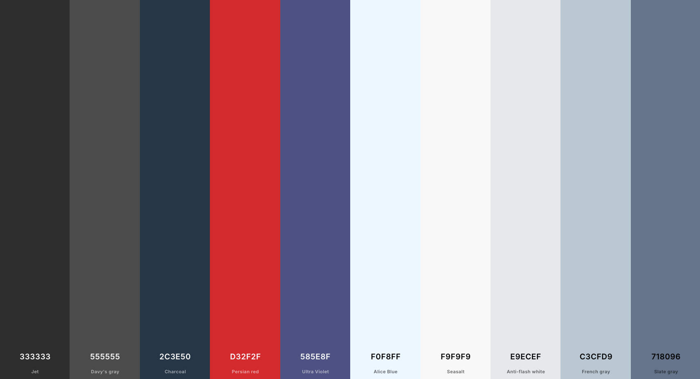
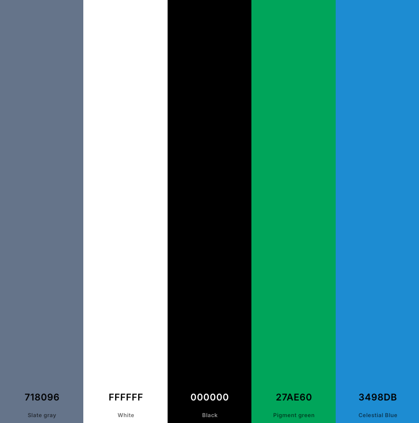

# Happy Rental Jönköping

## Introduction 

Welcome to Happy Rental Jönköping! This is a small, local company dedicated to providing car and RV van rentals in the beautiful city of Jönköping, located in the scenic region of Småland, Sweden. The goal of this app is to make it easy for visitors and residents alike to rent vehicles and discover all the wonderful sights that this area has to offer. With this platform, users can conveniently explore Jönköping and its surroundings, enjoying their days in this amazing part of Sweden. I’m excited to share the features and ideas behind this project with you!

### User Stories

#### Navigating the Site

* As a user I can view a navbar so that I can easily navigate the site

#### Authentication

* As a user, I want to register for an account so that I can unlock and use all features available to authenticated users.
* As a user, I want to log in to my account so that I can access personalized functionalities and content.
* As a user, I want to easily determine if I am currently logged in because the navbar updates to show different links, including a 'Log Out' option, so I can decide whether to log in or log out accordingly.
* As a user, I want to stay logged in until I actively choose to log out, ensuring a smooth and uninterrupted experience.

#### About Us Page

* As a user, I want to learn about the company's history and mission so that I can understand what drives their services.
* As a user, I want to see the company's achievements and future plans so that I can trust their growth and commitment.
* As a user, I want to get to know the team and their values so I feel confident about engaging with their services.

#### Rent Page

* As a user, I want to select my desired rental dates on the calendar so that I can specify the period I want to book a car.
* As a user, I want to see available cars based on my selected dates so I can choose the most suitable vehicle for my trip.
* As a user, I want to receive feedback after I book a car, such as a confirmation message, so I know my reservation was successful.
* As a user, I want to see clear information about the steps involved in booking a car so I understand the process and what to expect.

#### All Cars Page

* As a user, I want to see a list of all available cars with basic details so I can compare options and select a suitable vehicle.
* As a user, I want each car to display important information including description, price, model, and maximum passengers so I can make an informed decision.
* As a user, I want the car information to be clear and well-organized, so I can easily understand the features and specifications of each vehicle.

#### My Rentals Page

* As a user, I want to see a list of all my current and past bookings so I can keep track of my reservations.
* As a user, I want each booking to display key details such as car information, rental dates, and reservation number so I can easily identify each reservation.
* As a user, I want to be able to cancel or modify my upcoming bookings directly from the list so I can manage my reservations efficiently.

#### Reviews Page

* As a user, I want to see reviews and ratings from other customers so that I can get an idea of their experiences.
* As a user, I want to be able to write and submit my own review and rating, so I can share my feedback about the service.
* As a user, I want to edit or delete my own reviews so that I can update or remove my feedback if needed.
* As a user, I want to view reviews even when I am not logged in so that I can consider feedback before deciding to sign in or make a reservation.

#### Contact Page 

* As a user, I want to be able to contact the company so I can ask questions or get assistance when needed.
* As a user, whether registered or not, I want to send a message to the company through the contact form so I can inquire about services or issues even without logging in.

#### Social Media

* As a user, I would like to see the company's social media pages so that I can follow or engage with them on different platforms.

#### Admin Stories 

* As an admin, I want to be able to manage user interactions and content by deleting offensive or harmful comments, reviews, or user accounts. This allows me to maintain a safe and respectful environment within the platform.
* Additionally, I want to be able to view contact messages and reviews to monitor feedback and ensure user concerns are addressed promptly.
* Overall, I need control over user management and content moderation to uphold community standards and protect employees and users from disrespectful behavior.

#### User Stories Information

* Initially, I outlined high-level user stories to guide the overall structure and features of the project, focusing on the main functionalities users would need. As I progressed, I created more detailed, specific user stories in GitHub to break down those broader goals into actionable tasks and edge cases, helping to refine the development process and ensure a thorough understanding of each component.

### Agile Aproach

The project was organized with associated user stories and tasks using GitHub Projects. You can find the project at [Car Rental booking App](https://github.com/users/Yuss76A/projects/10/views/1).

* Here, you can see the user stories that I previously shared, but in a more detailed form, which were developed from those initial stories. Up to user story number 9, they mainly focused on the backend functionalities. Additionally, I created stories related to the frontend, which are explicitly labeled as "front end" in the titles. I included these front-end stories to ensure I didn’t forget any important aspects during the development process, even if some of them might overlap with the backend stories. This way, I aimed to cover all the key features and avoid missing anything crucial while building the project.

## Design Choices

### Fonts

Arial, sans-serif, and Georgia were chosen as the primary fonts for the project because they are classic, widely supported, and ensure good readability across different devices and browsers. These fonts provide a clean and professional look, making the content easy to read and visually accessible. Since they are system fonts, they also help improve page load times and maintain consistency without relying on external font libraries, which is beneficial for the overall performance and reliability of the website.

### Colours

Colours for the website where selected using [Coolors](http://coolors.co "Coolors").

* #333 (Dark Gray) - Used for main headings and titles (e.g., .about-us-title, .pageTitle) to provide a strong, neutral contrast for readability.
* #555 (Medium Gray) - Body text and content descriptions, offering a softer contrast for readability without being too harsh.
* #2c3e50 - Used for main titles and headings (e.g., .pageTitle) to give a dark, professional tone and for overall navigation header text.
* #d32f2f - Indicates errors, warning states, and alert messages (e.g., .errorMessage, .error, .cancelButton hover). Conveys urgency and failure status.
* #27ae60 - Success notifications and positive status indicators (e.g., .successAlert, .statusMessage.success).
* #3498db - Emphasizes interactive elements such as icons, links, buttons.
* #f0f8ff - Background colors for sections like "how-it-works" and rental process steps. Creates a calm, welcoming environment.
* #f9f9f9 - Background for form sections, containers, and buttons to provide a neutral, clean interface.
* #f8f9fa -  Light backgrounds and border colors for containers, input fields, and layout elements, maintaining a minimalistic and clean look.
* #c3cfd9 - Used mainly for background gradients in containers, adding subtle visual interest without distracting from content.
* #718096 (Grayish Blue) - Muted text or secondary information like reminder texts.
* #ffffff (White) - Backgrounds for text boxes, buttons, cards, and containers, ensuring high contrast for text readability.
* #000000 (Black) - Not explicitly used in the CSS provided, but typically used for textual emphasis when needed.

### Navbar and Footer Colours

Navbar:
* Background: A linear gradient with shades of blue: linear-gradient(135deg, #2874a6 0%, #239b56 100%)
* Text and icons (brand, links, toggler icon): White (#ffffff), with transition effects for hover interactions

Footer:
* Background: Same as the navbar gradient: linear-gradient(135deg, #2874a6 0%, #239b56 100%)
* Text: White (#ffffff) for links and copyright text
* Hover Effects: Links change to pure white for emphasis, with underline or color transition (color: white; text-decoration: underline;)
* Responsive footer: Slightly darker gradient for smaller screens: linear-gradient(135deg, #1a5276 0%, #186a3b 100%)

Summary:
* Navbar and footer share a consistent blue-green gradient color scheme with white text and icons.

.

Colours Information Text:

- I have made an effort to carefully note and keep track of all the colors used throughout the project. I aimed to clearly explain the purpose of each color and the reasons for their selection. However, given the size and complexity of the project, there is a possibility that I may have unintentionally overlooked mentioning some colors. I apologize if I missed any details, and I appreciate your understanding.

### Icons

The icons used for the site were sourced from [Font Awesome](https://fontawesome.com/ "Font Awesome").

## Structure

The website’s architecture is divided into frontend and backend components. The frontend will be developed using [React](https://react.dev/), complemented by custom [CSS](https://en.wikipedia.org/wiki/CSS) for styling, and [React Bootstrap](https://react-bootstrap.netlify.app/) to ensure a cohesive and modern design. The backend will be implemented with [Django Rest Framework](https://www.django-rest-framework.org/), responsible for managing all data and efficiently passing it to the frontend as required. This setup aims to provide a reliable, scalable, and user-friendly system.