# Happy Rental Jönköping

## Introduction 

Welcome to Happy Rental Jönköping! This is a small, local company dedicated to providing car and RV van rentals in the beautiful city of Jönköping, located in the scenic region of Småland, Sweden. The goal of this app is to make it easy for visitors and residents alike to rent vehicles and discover all the wonderful sights that this area has to offer. With this platform, users can conveniently explore Jönköping and its surroundings, enjoying their days in this amazing part of Sweden. I’m excited to share the features and ideas behind this project with you!

## Links to the Deployed Sites

[Happy Rental Backend - API live site](https://carbookingbackend-df57468af270.herokuapp.com/)

[Happy Rental Jönköping - Front-End live site](https://highway-to-rent-6dc001f7bfed.herokuapp.com/)

[Readme Backend](https://github.com/Yuss76A/app-backend)

### User Stories

#### Navigating the Site

* As a user I can view a navbar so that I can easily navigate the site

#### Authentication

* As a user, I want to register for an account so that I can unlock and use all features available to authenticated users.
* As a user, I want to log in to my account so that I can access personalized functionalities and content.
* As a user, I want to easily determine if I am currently logged in because the navbar updates to show different links, including a 'Log Out' option, so I can decide whether to log in or log out accordingly.
* As a user, I want to stay logged in until I actively choose to log out, ensuring a smooth and uninterrupted experience.

#### About Us Page

* As a user, I want to learn about the company's history and mission so that I can understand what drives their services.
* As a user, I want to see the company's achievements and future plans so that I can trust their growth and commitment.
* As a user, I want to get to know the team and their values so I feel confident about engaging with their services.

#### Rent Page

* As a user, I want to select my desired rental dates on the calendar so that I can specify the period I want to book a car.
* As a user, I want to see available cars based on my selected dates so I can choose the most suitable vehicle for my trip.
* As a user, I want to receive feedback after I book a car, such as a confirmation message, so I know my reservation was successful.
* As a user, I want to see clear information about the steps involved in booking a car so I understand the process and what to expect.

#### All Cars Page

* As a user, I want to see a list of all available cars with basic details so I can compare options and select a suitable vehicle.
* As a user, I want each car to display important information including description, price, model, and maximum passengers so I can make an informed decision.
* As a user, I want the car information to be clear and well-organized, so I can easily understand the features and specifications of each vehicle.

#### My Rentals Page

* As a user, I want to see a list of all my current and past bookings so I can keep track of my reservations.
* As a user, I want each booking to display key details such as car information, rental dates, and reservation number so I can easily identify each reservation.
* As a user, I want to be able to cancel or modify my upcoming bookings directly from the list so I can manage my reservations efficiently.

#### Reviews Page

* As a user, I want to see reviews and ratings from other customers so that I can get an idea of their experiences.
* As a user, I want to be able to write and submit my own review and rating, so I can share my feedback about the service.
* As a user, I want to edit or delete my own reviews so that I can update or remove my feedback if needed.
* As a user, I want to view reviews even when I am not logged in so that I can consider feedback before deciding to sign in or make a reservation.

#### Contact Page 

* As a user, I want to be able to contact the company so I can ask questions or get assistance when needed.
* As a user, whether registered or not, I want to send a message to the company through the contact form so I can inquire about services or issues even without logging in.

#### Social Media

* As a user, I would like to see the company's social media pages so that I can follow or engage with them on different platforms.

#### Admin Stories 

* As an admin, I want to be able to manage user interactions and content by deleting offensive or harmful comments, reviews, or user accounts. This allows me to maintain a safe and respectful environment within the platform.
* Additionally, I want to be able to view contact messages and reviews to monitor feedback and ensure user concerns are addressed promptly.
* Overall, I need control over user management and content moderation to uphold community standards and protect employees and users from disrespectful behavior.

#### User Stories Information

* Initially, I outlined high-level user stories to guide the overall structure and features of the project, focusing on the main functionalities users would need. As I progressed, I created more detailed, specific user stories in GitHub to break down those broader goals into actionable tasks and edge cases, helping to refine the development process and ensure a thorough understanding of each component.

#### Additional Note on User Stories

Some of the user stories from this section are also found in the "User Stories" section of the backend README—they concern backend functionalities like data management, APIs, and security. I chose to keep these stories in the frontend README as well to provide a complete overview of the features I developed. 

It's important to understand that the backend supports and manages these core features, which enable the frontend to function properly. I didn't remove or duplicate them; instead, I kept them to give a clear picture of both how the frontend interacts with the backend and the overall development process.

### Agile Aproach

The project was organized with associated user stories and tasks using GitHub Projects. You can find the project at [Car Rental booking App](https://github.com/users/Yuss76A/projects/10/views/1).

* Here, you can see the user stories that I previously shared, but in a more detailed form, which were developed from those initial stories. Up to user story number 9, they mainly focused on the backend functionalities. Additionally, I created stories related to the frontend, which are explicitly labeled as "front end" in the titles. I included these front-end stories to ensure I didn’t forget any important aspects during the development process, even if some of them might overlap with the backend stories. This way, I aimed to cover all the key features and avoid missing anything crucial while building the project.

## Design Choices

### Fonts

Arial, sans-serif, and Georgia were chosen as the primary fonts for the project because they are classic, widely supported, and ensure good readability across different devices and browsers. These fonts provide a clean and professional look, making the content easy to read and visually accessible. Since they are system fonts, they also help improve page load times and maintain consistency without relying on external font libraries, which is beneficial for the overall performance and reliability of the website.

### Colours

Colours for the website where selected using [Coolors](http://coolors.co "Coolors").

* #333 (Dark Gray) - Used for main headings and titles (e.g., .about-us-title, .pageTitle) to provide a strong, neutral contrast for readability.
* #555 (Medium Gray) - Body text and content descriptions, offering a softer contrast for readability without being too harsh.
* #2c3e50 - Used for main titles and headings (e.g., .pageTitle) to give a dark, professional tone and for overall navigation header text.
* #d32f2f - Indicates errors, warning states, and alert messages (e.g., .errorMessage, .error, .cancelButton hover). Conveys urgency and failure status.
* #27ae60 - Success notifications and positive status indicators (e.g., .successAlert, .statusMessage.success).
* #3498db - Emphasizes interactive elements such as icons, links, buttons.
* #f0f8ff - Background colors for sections like "how-it-works" and rental process steps. Creates a calm, welcoming environment.
* #f9f9f9 - Background for form sections, containers, and buttons to provide a neutral, clean interface.
* #f8f9fa -  Light backgrounds and border colors for containers, input fields, and layout elements, maintaining a minimalistic and clean look.
* #c3cfd9 - Used mainly for background gradients in containers, adding subtle visual interest without distracting from content.
* #718096 (Grayish Blue) - Muted text or secondary information like reminder texts.
* #ffffff (White) - Backgrounds for text boxes, buttons, cards, and containers, ensuring high contrast for text readability.
* #000000 (Black) - Not explicitly used in the CSS provided, but typically used for textual emphasis when needed.

### Navbar and Footer Colours

Navbar:
* Background: A linear gradient with shades of blue: linear-gradient(135deg, #2874a6 0%, #239b56 100%)
* Text and icons (brand, links, toggler icon): White (#ffffff), with transition effects for hover interactions

Footer:
* Background: Same as the navbar gradient: linear-gradient(135deg, #2874a6 0%, #239b56 100%)
* Text: White (#ffffff) for links and copyright text
* Hover Effects: Links change to pure white for emphasis, with underline or color transition (color: white; text-decoration: underline;)
* Responsive footer: Slightly darker gradient for smaller screens: linear-gradient(135deg, #1a5276 0%, #186a3b 100%)

Summary:
* Navbar and footer share a consistent blue-green gradient color scheme with white text and icons.

.

Colours Information Text:

- I have made an effort to carefully note and keep track of all the colors used throughout the project. I aimed to clearly explain the purpose of each color and the reasons for their selection. However, given the size and complexity of the project, there is a possibility that I may have unintentionally overlooked mentioning some colors. I apologize if I missed any details, and I appreciate your understanding.

### Icons

The icons used for the site were sourced from [Font Awesome](https://fontawesome.com/ "Font Awesome").

## Structure

The website’s architecture is divided into frontend and backend components. The frontend will be developed using [React](https://react.dev/), complemented by custom [CSS](https://en.wikipedia.org/wiki/CSS) for styling, and [React Bootstrap](https://react-bootstrap.netlify.app/) to ensure a cohesive and modern design. The backend will be implemented with [Django Rest Framework](https://www.django-rest-framework.org/), responsible for managing all data and efficiently passing it to the frontend as required. This setup aims to provide a reliable, scalable, and user-friendly system.

### React Components Example

The front end of this project was built using React, specifically version 19.1.0. React enables the development of reusable components that manage their own states and can be combined to create complex user interfaces. These components facilitate dynamic and interactive features on the site, enhancing user experience. The main components developed for this project are listed below. These components will be discussed in more detail in the features section of this readme.

### Navbar

Implements a responsive navigation bar that displays links based on user authentication status, including logout functionality.

### Footer

Creates a footer with navigation links and social media icons, along with a copyright notice, providing site-wide footer content and links.

### About Us 

Combines company history, achievements, and rental process details with engaging visuals and icons, providing visitors with comprehensive information about the business and how to get started.

### Rent

Provides a dynamic calendar interface for users to select rental dates, filters available cars based on those dates, and facilitates the booking process with real-time feedback and car details display.

### All Cars

Displays detailed information about a specific car, including model name, price per day, maximum passengers, and description, with fallback values for missing data for better user experience.

### My Rentals

Manages and displays the user's booked dates, allowing them to view, edit, or cancel reservations, with real-time data fetching and state management for bookings and car details.

### Reviews 

Manages user reviews with functionalities to create, update, delete, and paginate reviews, including form validation, error handling, and integration with backend API, offering a complete review management system.

### Contact

Provides a user-friendly contact form with validation, submitting messages via API, and displaying success or error notifications to facilitate communication between users and the service.

### Private Policy

Presents a comprehensive overview of how user data is collected, used, shared, and protected, ensuring transparency and building trust with visitors about their privacy and data security.

### Wireframes

Wireframes have been created using [Balsamic](https://balsamiq.com "Balsamic"). Wireframes provide a foundational visual overview of the website’s intended layout and structure. Please note that the final implementation may include slight adjustments to optimize user experience and design aesthetics.

**About Us Page Wireframe**  

**Rent Page Wireframe**  

**All Cars Page Wireframe**  

**Reviews Page Wireframe**  

**My Rentals Page Wireframe**  

**Private Policy Page Wireframe**  

**Contact Us Page Wireframe**  

**Sign In Page Wireframe**  

**Sign Up Page Wireframe**  

**Review Page Logout Mode Wireframe**  

## Features

### About Us Page

This page thoughtfully combines essential information about the company's journey, milestones, and operational procedures. It features a detailed overview of the company's history, highlighting key achievements such as awards, expansion milestones, and sustainability initiatives, which build trust and credibility. The "How It Works" section guides users through the rental process step-by-step, making it easy for new customers to understand how to utilize the service. Together, these elements create an informative, engaging, and professional presentation of our brand's story and operational excellence.

**About Us Page**  

**About Us Page**  

**About Us Page**  

**About Us Page Mobile**  

### Rent Page

The Booking Component offers a user-friendly way to choose your rental dates. Once you select your desired dates and click the "Book Cars" button, the available cars will appear below the calendar. You also can toggle additional information about the rental process. If some cars are already booked for those dates, they won’t be available for selection. The seamless design provides a smooth experience from selecting dates to finalizing your reservation—making everything simple, clear, and enjoyable for you.

Additionally, when you successfully book a car, you will receive a unique reservation code. This code is randomly generated each time and serves as your personal confirmation. It helps you easily manage and reference your booking, ensuring a hassle-free experience from start to finish.

**Rent Page**  

**Rent Page Mobile Mode**  

### All Cars Page

The All Cars Page showcases the company's entire fleet of vehicles in a clean, organized grid layout, with three cars displayed per row. Visitors can view detailed information about each car, including pictures, prices, and other specs—all fetched dynamically from the backend Django server. This comprehensive listing makes it easy for users to explore the full selection of available vehicles, helping them find the perfect car for their needs. The page also features loading indicators during data retrieval and handles errors smoothly, providing a seamless browsing experience.

**All Cars Page**  

**All Cars Page Mobile Mode**  

### Reviews Page

The Reviews page displays feedback from all customers, allowing everyone—including visitors who are not signed in—to read honest reviews about our services. Reviews are submitted anonymously to protect user privacy. Registered users can leave their own reviews, as well as edit or delete their feedback at any time. If you're not logged in, you can still browse the reviews to get a sense of others' experiences, but sharing your own feedback requires signing in. This setup encourages transparency while maintaining user privacy and control over their submissions.

**Reviews Page**

**Reviews Page Mobile Mode**  

**Reviews Page LoggedOut**  

**Reviews Page Mobile Mode LoggedOut**  

### My Rentals Page

This page provides a comprehensive view of all your active and upcoming bookings. You can see detailed information for each reservation, including the start and end dates, a picture of the car, and your unique reservation number. The reservations are organized by month and year, making it easy to navigate through your upcoming trips. The interface allows you to manage your bookings with options to edit or cancel, giving you full control and clear visibility over your rentals. When editing a booking, if the car you choose is already booked for the new dates, an error message will be displayed, and the change will not be processed. It’s all designed to be simple, transparent, and convenient for you.

**My Rentals Page**  

**My Rentals Page Mobile Mode**  

### Private Policy

This page outlines how Happy Rental collects, uses, shares, and protects your personal information. It details the types of data we gather when you rent a vehicle, including personal details, payment information, and technical data. It explains how your data helps us manage reservations, improve our services, and comply with legal requirements. The policy also emphasizes our commitment to data security and your rights to access, update, or delete your information. For any privacy-related questions, you can find contact details and learn more about how we safeguard your data. Overall, this page ensures transparency and builds trust by clearly communicating our privacy practices.

**Private Policy Page**  

**Private Policy Page Mobile Mode**  

### Conta Us Page

This contact form allows users, whether registered or not, to easily reach out with questions or comments about our car booking services. It includes fields for full name, email, and message, with validation to ensure the user provides all necessary information correctly. When a user submits the form, the data is sent to our backend, and the user receives feedback confirming whether their message was successfully sent or if there was an error. The design emphasizes simplicity and user-friendliness, enabling efficient communication and helping us improve customer engagement.

**Contact Us Page**  

**Contact Us Page Mobile Mode**  

### Sign Up Page

This component features a clean, modern design that invites new users to create an account by entering their name, email, and password. It includes validation to ensure passwords match and provides real-time feedback to guide users. A friendly prompt — "If you already have an account, sign in" — offers a quick way for returning users to navigate to the login page. The registration process is integrated with Django's built-in authentication system, which handles user creation and validation seamlessly in the background. The form’s simple and user-friendly layout encourages new registrations with an effortless onboarding experience.

**Sign Up Page**  

**Sign Up Page Mobile**  

### Login Page ( Sign In)

This component provides a sleek and straightforward interface that allows users to access their accounts by entering their email and password. It communicates with the backend, which is built on Django’s robust authentication system, to verify credentials securely. When login is successful, user information and authentication tokens are stored locally, and the user is redirected back to their previous activity or the homepage. The form is designed for simplicity and clarity, offering helpful feedback for invalid credentials and ensuring a smooth, efficient login experience for every user.

**Login Page**  
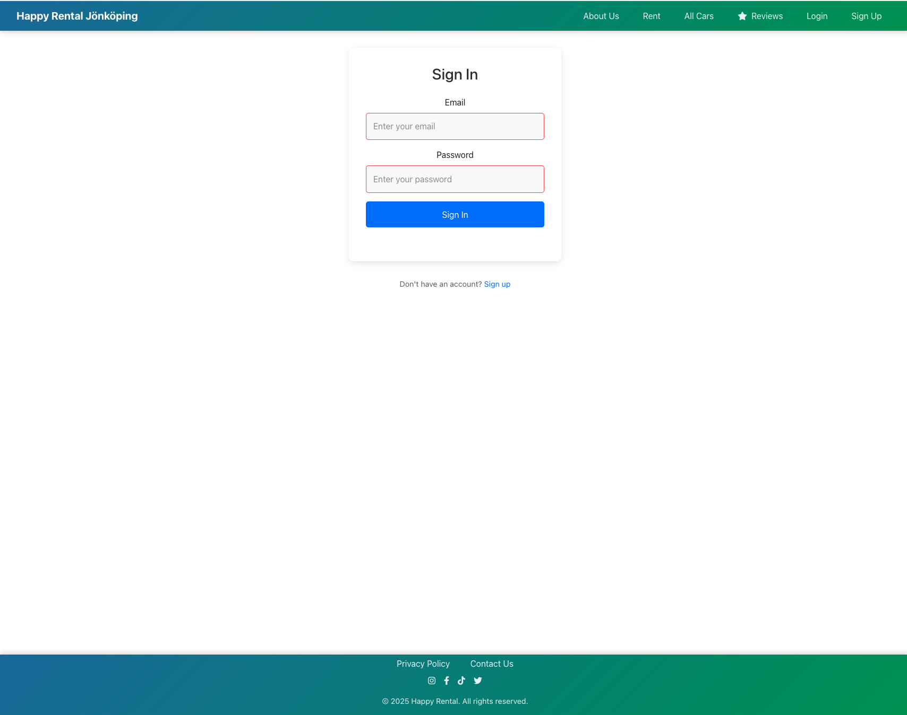

**Login Page Mobile**  

### Navbar

The navbar has a classic, clean design that blends well with the overall style of the site. Its background features a vibrant gradient from deep blue to lush green, which reflects the company's support for sustainable vehicles and eco-friendly initiatives. The color scheme—rich greens and blues—creates a fresh, natural, and trustworthy feel, emphasizing the company's commitment to environmental responsibility.

The layout is straightforward and easy to navigate, with links for key pages like "About Us," "Rent," "All Cars," and "Reviews." When users are logged in, a "Logout" button appears, providing a clear way to sign out. If not logged in, users see options to "Login" or "Sign Up." 

Importantly, while anyone can browse the "Rent" and "Reviews" pages, they need to be registered and logged in to make bookings or leave reviews, maintaining a secure and user-focused service.

The design ensures a seamless experience across devices, with responsive adjustments for smaller screens, including stylish burger menus that fit neatly into mobile views. Overall, the color palette and layout reinforce the brand’s focus on sustainability while offering a professional and inviting interface for all users.

**Navbar**   

**Navbar Logged Out**  

**Navbar Mobile**  

**Navbar Mobile Logged Out**  

### Footer

The footer is a fixed, full-width component positioned at the bottom of the page, providing easy access to important links and social media profiles. Its background features a gradient from deep blue to lush green, reflecting the company's focus on sustainability and eco-friendly initiatives. The footer includes links to the Privacy Policy and Contact page, helping users find essential information quickly. Social media icons for Instagram, Facebook, TikTok, and Twitter are prominently displayed, encouraging visitors to connect with us on various platforms. The overall design ensures clarity and accessibility across all devices, with responsiveness tailored for smaller screens. It’s styled with smooth hover effects and a subtle shadow to distinguish it from the main content, maintaining a professional and trustworthy appearance.

**Footer**  

**Footer Mobile**  

### Rating

Logged-in users can rate the company on a scale from 0 to 5 stars. The rating is visually displayed with stars filled in gold or yellow, providing a clear and attractive overview. For example, if a user gives a rating of 2 out of 5, two stars will be filled, and the remaining three stars will be empty, making the feedback easy to understand at a glance.

**Rating**  

### Review Link Navbar

The navigation bar includes a direct link to the Reviews page, marked with a star icon. This makes it easy for users to quickly access customer feedback and see honest reviews from others. The star icon helps draw attention to this section, encouraging visitors to explore what others think about our service. Whether you're looking for insights or want to share your own experience, this link provides a convenient shortcut at the top of the site.

**Review Link**  

### Social Media Links

The footer includes icons linking to the company's official social media profiles—Instagram, Facebook, TikTok, and Twitter. These icons provide visitors with quick access to follow or engage with the company on various platforms. Each link opens in a new tab to ensure users remain on the website while exploring the social content. Incorporating these links helps increase online visibility and encourages community interaction, aligning with the brand’s modern and professional look.

**Social Media**  

### Welcome Message

The welcome message pops up in the center of the screen with a green background that matches the overall page theme. It catches your attention right away by being prominent and nicely centered. After a couple of seconds, it automatically disappears, so it doesn’t stay on the screen too long. The idea is to give users a quick, friendly confirmation that they have logged in or been welcomed, making the experience feel smooth and natural. This small notification helps users know that their action was successful without disturbing their flow.

**Welcome Message**  

**Welcome Message Mobile**  
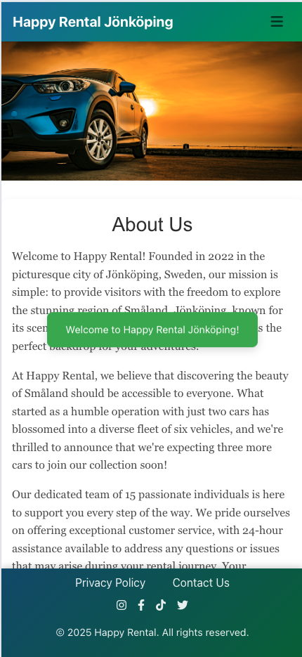

### CRUD Functionality

User Authentication
Users can register for an account and log in to access features like creating reviews and bookings. Logged-in users can also update or delete their own reviews and bookings.

Reviews
Logged-in users can create reviews with ratings and comments for cars. They can edit or delete their own reviews as needed.

Permissions & Security
The system ensures users can only modify their own content, while admin users have full control. Error handling and validation are included to improve user experience.

Car Listings & Bookings
Admin users can add new cars, edit existing cars, or delete cars from the system.
Regular users can browse available cars and make bookings. Users can view or cancel their current bookings. The system checks to prevent double bookings for the same car during overlapping dates.

Contact Messages
Users can send messages via a contact form by providing their full name, email, and message content. These messages are stored in the system, and only admins can view or delete them to respond accordingly.

## Testing

### Front End

#### HTML Testing

HTML testing was completed by running the website through [W3C HTML Validator](https://validator.w3.org/). The results were as follows:

**HTML Validation**  
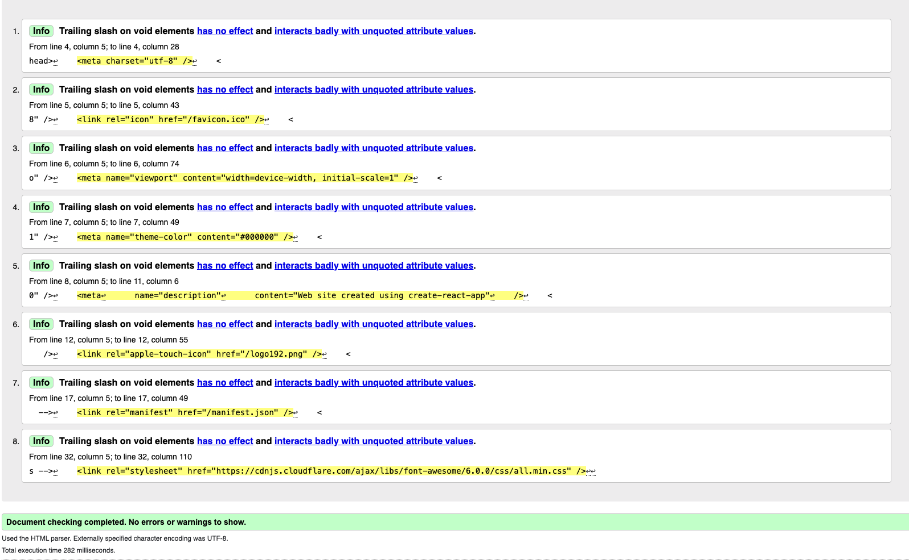

The validator gave an informational warning about the trailing slashes on void elements (like <meta>, <link>, etc.). This is just a note because, in HTML5, the trailing slash is optional and doesn't impact how browsers interpret the code. It’s a stylistic preference, and since the code remains valid and works correctly, these warnings can be safely ignored. There’s no actual issue with the current code; it’s just a validation note, not a problem affecting functionality.

### CSS Validation

**CSS Validation**  

The CSS validation passed without any errors.

### Automated Testing

I implemented automated tests to verify the signup form works correctly. The tests check that:

1. The form successfully submits user data to the /register/ API endpoint

2. All required fields (name, email, password) are included in the submission

3. The data is properly formatted before being sent to the backend

These tests run automatically and help catch any errors in the registration process before they affect users. The test results confirm that new users can reliably create accounts through the form.

**Results Test**  
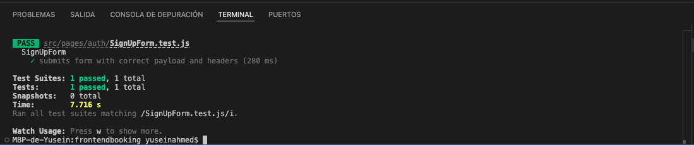

### Manual Testing

Throughout the development process and upon final completion, manual testing was performed. The outcomes are summarized in the table below.

| Feature Tested                                 | Feature Description                                                                 | Testing Completed                                                  | Expected Outcome                                                                                      | Result       |
|------------------------------------------------|-------------------------------------------------------------------------------------|----------------------------------------------------------------------|--------------------------------------------------------------------------------------------------------|--------------|
| Registration                                         | Register a new user with a unique email.                      | Fill registration form with valid data.                   | User should be created successfully.                          | As expected  |
| Login                                                  | Log in with registered email and password.                      | Enter correct credentials.                                | Logged in successfully, user details displayed.           | As expected  |
| Login with wrong credentials                           | Try logging in with wrong email or password.                    | Receive error message about user not found.               | Error message shown: user not found. | As expected  |
| Rent page                                              | Check if the calendar displays correctly.                        | Open rent page and view the calendar.                     | Calendar displays properly with correct dates.              | As expected  |
| Rent page                                              | Two buttons: "How to Book" and "Show Info".                     | Click each button separately.                                | "How to Book" shows booking instructions; "Show Info" displays additional info. | As expected  |
| Rent page                                              | Cannot select past days to book.                                | Try to select dates before today.                            | Past dates are disabled and cannot be selected.             | As expected  |
| Rent page                                              | Select a day and book a car, receive reservation code.          | Choose a date, confirm booking.                                | Reservation code displayed successfully.                     | As expected  |
| Welcome message                                        | Welcome message displayed in the center when logged in.        | Log in and view the screen.                                    | Message appears centered as expected.                          | As expected  |
| Rent page                                              | Cannot book a car if it's already booked by another user for selected dates. | Select dates overlapping existing booking and try to book. | Booking is blocked with an error message.                     | As expected  |
| Navbar links                                           | Navbar links change correctly based on login status.            | Log in and out, check the links in the navbar.                | Links display appropriately for logged in and logged out states. | As expected  |
| Footer links                                             | Footer links work as expected.                                    | Click each footer link.                                         | Links redirect to correct pages or sections.                      | As expected  |
| Reviews page                                             | Reviews are displayed correctly.                                   | Visit the reviews page.                                          | All reviews show properly with correct details.                    | As expected  |
| Reviews pagination                                       | Pagination switches correctly after 8 reviews.                   | Navigate through pages.                                          | Next pages load with correct reviews and total page count.       | As expected  |
| Rating system                                              | Max 5 stars, filling stars in gold based on rating.               | User rates 2 stars.                                              | 2 stars appear filled in gold, remaining 3 are empty.            | As expected  |
| Review comment date                                        | Dates in review comments display correctly.                        | View reviews with comments.                                      | Dates show accurately as expected.                                | As expected  |
| User review management                                      | User can delete or edit their own reviews.                         | Edit or delete a review they created.                            | Review updates or disappears successfully.                        | As expected  |
| User authorization                                            | Only logged-in users can add reviews and book cars.              | Try to review or book without logging in.                        | Action is blocked; prompts to log in are shown.                   | As expected  |
| Reviews access                                                | Not logged users can view and read reviews.                        | Visit the reviews page without logging in.                        | Reviews display properly; read-only access works as expected.  | As expected  |
| User bookings                                                 | User can see their bookings with start/end dates, image of the car and reservation number. | Log in and view My Rentals.                                      | Booking display correctly with all details.                     | As expected  |
| Edit and delete bookings                                      | Buttons work correctly; user can edit or delete.                 | Edit a booking; try to set dates overlapping existing bookings. | Error message shown if dates are already booked; edit/update succeeds if dates are free. | As expected  |
| All cars displayed                                              | All cars show with name, price, and description.                 | Visit the All Cars page.                                          | Everything displays correctly as expected.                         | As expected  |
| Contact page                                                    | Contact page works as expected.                                    | Submit a message. | Message sent successfully and confirmation message displayed. | As expected  |
| Admin actions                                                     | Admin can read emails, modify bookings, manage cars, delete users, reviews, bookings, and contact messages. | Perform admin tasks like viewing emails, editing data, deleting entries. | All actions complete successfully; data updates reflect correctly. | As expected  |
| Welcome message after registration | After a user successfully registers, a clear welcome message appears on the screen, confirming registration success. | Upon successful registration, the message "Welcome to Happy Rental Jönköping!" is displayed prominently on the page. | User sees a visible, congratulatory message confirming they are registered and welcomed. | As expected |

I have listed all the features I manually tested and observed during the testing process. If I happened to forget something, that can happen — tracking every detail can be challenging. I apologize in advance for any oversights and appreciate your understanding.

## Succes and Error Messages

Important Note:

- In this section, I will showcase the success and error messages implemented in the project. I have tried to track and include all the messages I've added. However, given the size of this project, it might be possible that some messages are not listed here or do not appear. If that's the case, I apologize—keeping track of every message across a large project can be challenging.  

**Duplicated Email**  
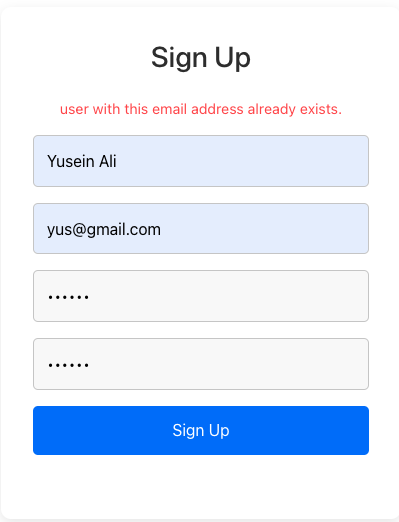

**Password Do Not Match**  
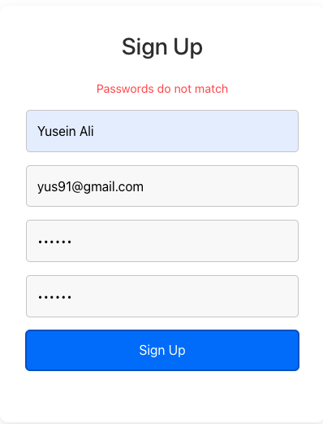

**Invalid Password**  
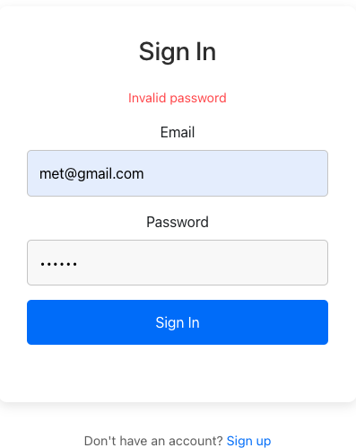

**You Can Not Select Past Days**  

**Start And End Date**  
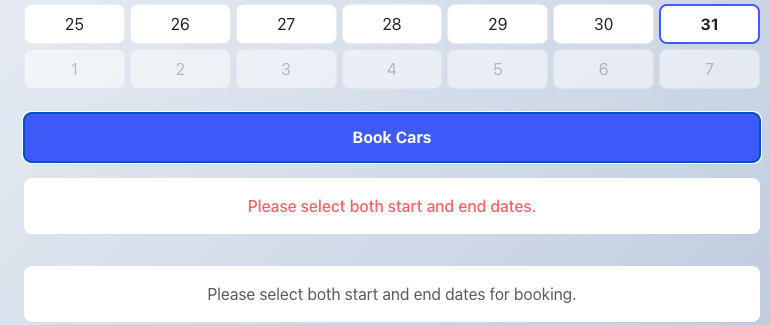

**Already Booked Car**  
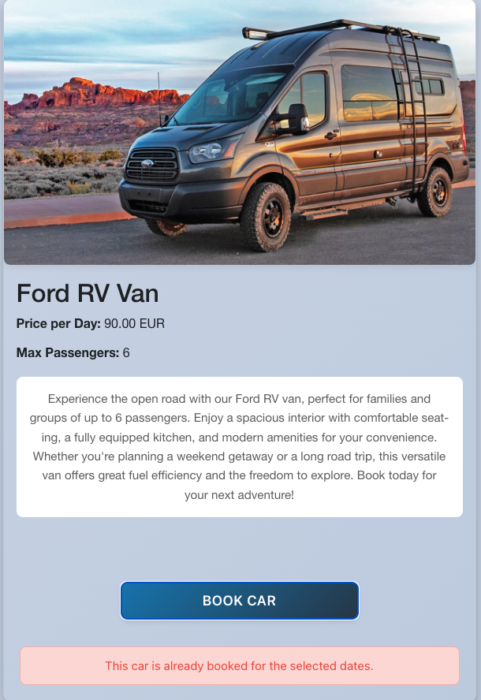

**Booking Success**  
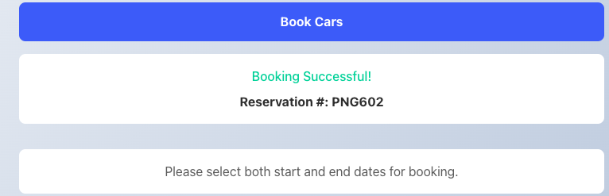

**Review Success**  
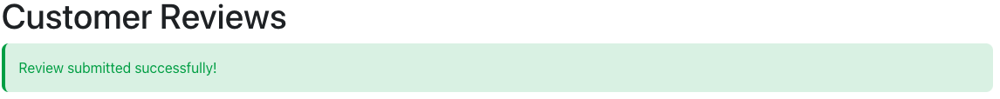

**Review Deleted**  
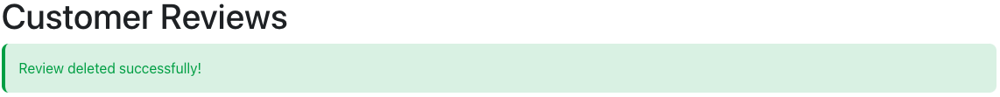

**Booking Canceled**  
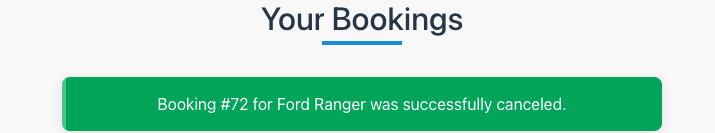

**End Must be after Start Date**  
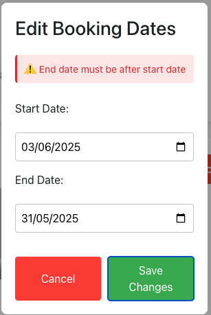

**Booking Updated**  
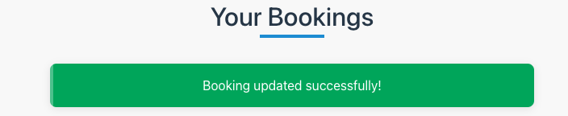

**Contact Request**  

**Editing Booking Fail / Car Already Booked**  
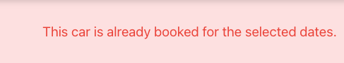

### Manual Testing Summary CRUD:

Extensive manual testing was conducted across all CRUD operations within the backend system. During creation tests, new entries were correctly added to the database, reflecting the intended data. Update operations successfully modified existing records, with changes accurately saved. Deletion tests effectively removed specified data entries from the database, confirming proper functionality of delete actions.

## Site Management in Django Admin

 Everything you do on the website—like booking, reviewing, or managing your account—is actually managed behind the scenes by the admin or authorized staff through the Django admin page. They handle all the data, approve reviews, update car info, and manage bookings directly. So while it looks seamless on your side, all the actions are controlled by trusted personnel to keep everything organized and secure.

 **Django Admin**  
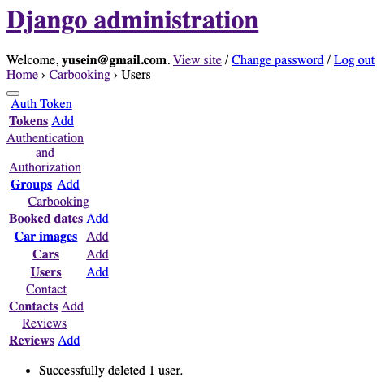

## Technologies Used

### Languages

* [HTML](https://en.wikipedia.org/wiki/HTML "HTML")  
  Used for structuring the web pages and defining the layout of the user interface.

* [CSS](https://en.wikipedia.org/wiki/CSS "CSS")  
  Used for styling the web pages, including layout, colors, fonts, and responsiveness.

* [JavaScript](https://en.wikipedia.org/wiki/JavaScript "JavaScript")  
  Implements client-side functionality, interactivity, and dynamic content updates in the frontend.

* [Python](https://en.wikipedia.org/wiki/Python_(programming_language) "Python")  
  Used for backend development with Django, handling data, authentication, and API creation.

### Libraries & Framework

### Libraries & Frameworks

* [React Bootstrap v4.6](https://react-bootstrap-v4.netlify.app/ "React Bootstrap")  
  A React component library that integrates Bootstrap's styles and components, enabling building responsive, styled user interfaces quickly.

* [Font Awesome](https://fontawesome.com/)  
  For icons, included via CDN with the script tag:
  ``

### State Management with Contexts

UserContext: Manages the authenticated user's state across the application. It tracks whether a user is logged in, stores their basic profile information, and handles login and logout actions. This allows components throughout the app to adapt their behavior based on the user's authentication status, ensuring a personalized and seamless user experience.

### Toggles and Navigation Logic

The navigation bar uses Bootstrap’s built-in toggle feature so on smaller screens, clicking the hamburger icon smoothly shows or hides the menu items.

The links change depending on whether the user is logged in. If they’re logged in, they see options like “My Rentals” and "Logout." When they click "Logout," it clears their info from storage, updates the app state, and automatically redirects them to the homepage.

If they’re not logged in, they see "Login" and "Sign Up" links. Also, when a logged-in user clicks certain links, like "My Rentals," they are taken directly to that page—no extra steps needed.

This setup makes navigation clear and smooth, whether on desktop or mobile, and always shows the right options based on login status.

### Package.json: Project Dependencies

This file manages all the libraries and tools our project relies on.
Dependencies are external packages needed for the app to work, like React, Bootstrap, Axios, and icons.
Dev Dependencies are tools used during development, like testing libraries and code linters, which help keep the code quality high.
The scripts section includes commands to run the app locally, build it for production, or run tests.

### Tools

Here are the main tools and libraries used to build and develop the project, helping ensure a smooth development process and a responsive website.

* [GitHub](https://github.com "GitHub") — Version control and project hosting.
* [Gitpod](https://gitpod.io "Gitpod") — Cloud-based development environment.
* [Balsamiq](https://balsamiq.com "Balsamiq") — Wireframing and UI design.
* [Coolors](https://coolors.co "Coolors") — Color palette generation.
* [Chrome DevTools](https://developer.chrome.com/docs/devtools "DevTools") — Browser debugging and inspection.
* [Heroku](https://heroku.com "Heroku") — Cloud platform for deployment.
* [Favicon](https://favicon.io/ "Favicon") — Custom favicon creation.

## Development and Deployment

Guidance on setting up the project locally and deploying it live.

####  Development

This section explains how to run the app locally for development purposes.

To run the app locally:
1. Clone this repository.
2. Run `npm install` to install dependencies.
3. Use `npm start` to start the development server.
4. Access the app at `http://localhost:3000`.

#### Deploying from a Github Repository

This section explains how to deploy the application to a live environment using Heroku, with step-by-step instructions.

1. Go to the Deploy tab in your Heroku dashboard.
2. Choose GitHub - Connect as your deployment method and authorize Heroku to access your GitHub account when prompted.
3. Select your GitHub account from the dropdown menu if it isn't already selected.
4. Search for your project repository and click Connect to link it to Heroku.
5. Scroll down to the Deploy section, where you can choose between Automatic Deploys and Manual Deploy.
- Automatic Deploys will update your app each time you push changes to the selected branch.
- Manual Deploy requires you to click a button each time you want to deploy.
6. Pick your preferred deployment option and select the branch you want to deploy from.
7. If you selected Automatic Deploys, click Enable Automatic Deploys to activate continuous deployment.
- If you chose Manual Deploy, hit Deploy Branch to start the deployment.
8. Wait for the deployment process to complete. Once finished, you'll see a confirmation message saying Your app was successfully deployed, along with a button to view your live site.

## Bugs

During the final review before writing this README, I identified a couple of issues:

- Booking without an end date: When a user selected a start date for a booking but did not select an end date, the available cars would still appear below in the "to be booked" list after clicking "Book Cars." However, because no end date was chosen, clicking the "Book" button for any car in that list would not work — it was effectively disabled.

This wasn't just a UX oversight; the main idea was that cars should only appear after both start and end dates are selected. If either date is missing, the available cars should not be shown to avoid confusion.

- Status: This bug has now been fixed. The system now correctly requires both start and end dates before displaying available cars, ensuring a smoother and more logical user experience.

- Editing bookings with past dates: Initially, I believed I had disabled the ability to select past dates when editing a booking, to prevent users from making invalid reservations. However, this restriction was not fully implemented, and users could still edit and save bookings with past dates.

- Status: This bug has now been fixed. The system now correctly prevents users from selecting past dates when editing bookings, ensuring all reservations remain valid and consistent.

## Note

I’ve tested and reviewed everything multiple times, and everything has been functioning as it should. That said, this is a big project, and no matter how much you test, mistakes can sometimes slip through. I might have overlooked some issues or made errors — it’s only human. I apologize if there are any problems, and I want to assure you that your feedback is always welcome. If you encounter any issues or mistakes, please don’t hesitate to contact us through the contact page or leave a comment in the reviews page. We are committed to improving and fixing things whenever possible.

## Future Features and Ideas

Due to limited time, personal commitments, and working a full-time job, I wasn't able to implement everything I envisioned for this project. I know the site could be much bigger and better — this is just the start. I focused on creating the basic functions of a car rental website, making sure it’s useful and easy to navigate.

Some ideas I’d like to add in the future include a user profile page where users can upload a picture, add personal details like phone number, and manage their information.Also, I’d like to introduce a way for users to pay directly after booking — making the process smoother and more seamless.

Other small ideas include a live map showing the exact location of the office, or perhaps a messaging/chat feature for users to communicate directly with the staff or each other. These are just some ideas for now—they could grow into much bigger features over time. 

Of course, once I start implementing one thing, new ideas often come up. This project is a work in progress, and I see it evolving and improving continuously. That’s what makes this journey exciting!

## Personal Reflection

When I started this project, it definitely wasn’t easy. I had a lot going on outside of my studies — working full time and trying to juggle everything else. Like I mentioned in my backend README, balancing those things made it really tough. I ran into issues sometimes trying to properly connect the backend with the frontend, and there were days I just didn’t even try. I got angry and felt like I wouldn’t be able to pull this off, so I skipped some days completely.

But here I am, at the end of what’s been an incredible journey over this past year. Despite the tough moments, I had a lot of fun working on this. It feels really good to see it come together, and I’ve learned a ton in the process. It wasn’t always smooth sailing, but I’m proud of what I managed to accomplish, and I’m grateful for the experience.

## A Note of Gratitude

Starting this journey with Code Institute has truly been a transformative experience. Their platform provided me with invaluable tools, guidance, and a structured path to learn and grow. I am grateful for the resources, support, and community they foster, which made tackling this project possible.

A special thanks goes to the assessors whose detailed feedback and constructive criticism helped me improve and push my skills further. Your insights challenged me to learn from my mistakes and to become better with each step.

I also want to extend my appreciation to the Slack community — a place where I found constant support, encouragement, and inspiration. Whenever I faced challenges or needed advice, this community was always there for me.

Thank you to everyone involved — Code Institute, the assessors, mentors, and the Slack community — for making this experience truly life-changing. Your support and guidance made all the difference.

## Favicon

A favicon is a small icon displayed in the browser tab next to your website's title, helping users easily identify your site. My favicon was custom-created using [Favicon](https://favicon.io/ "Favicon"), which allows easy generation of icons.

Steps to update or add a favicon:

- Create your favicon image using favicon.io, or prepare your own .ico or .png image.
- Save the generated favicon as favicon.ico and place it in the public folder of your project.
- Open the public/index.html file and place your favicon inside the <head> section.

**Favicon**  

## Media Section

In this section, you'll find the background image used in the "About Us" page, as well as all the car photos featured throughout the project. These images give you a visual overview of our fleet and the variety of vehicles we offer.

All images used in this project are sourced from official manufacturers, channels, or dedicated websites. The specific credits are as follows:

- The Kia car image is from MotorPassion Mexico.
- The Ford Ranger image is from ford.com.
- The Mazda vehicle image is from mazda.com.
- The Volkswagen car image is from volkswagen.com.
- The Fiat Ducato van image is from Carado.com.
- The Ford RV van image is from the "We're the Russos" YouTube channel, which features various travel styles including camper vans, international trips, and RV living.
- The background image used on the "About Us" page is from cargini.rent.

**Kia**

**Ford**

**Mazda**

**Volkswagen**

**Fiat Ducato**

**Ford RV**

**About Us Page Background Image**

## Inspiration and Idea

The main idea for this project came from a personal experience. I visited Jönköping before moving there permanently, and I wanted to rent a car for my stay. I called a rental company to book a vehicle, but on the day of the reservation, they couldn’t find my booking. I had to wait until the next day for an available car. Despite their efforts to locate my reservation, their fleet was limited at the Jönköping office, and I was lucky that a car became available the next day.

This experience highlighted the importance of a reliable, accessible, and well-managed rental service—something I wish I had during that time. The project was born from the desire to improve the rental experience, making it more seamless, transparent, and accessible for visitors and residents alike in Jönköping and beyond.

## Credits

I want to express my sincere gratitude to [CodeInstitute](https://codeinstitute.net/ "Code Institute") and their vibrant Slack community of mentors and fellow learners. Their support, advice, and shared knowledge have been instrumental in helping me progress throughout this project and reach my goals.

A special shoutout to my wife, Fatty, and my younger brother, Mett, whose encouragement, testing, and feedback were invaluable in shaping this work. Your support kept me motivated and focused.

I also owe a huge thank you to my mentor, [Iuliia Konovalova](https://github.com/IuliiaKonovalova), for your ongoing guidance and insightful tips. Your mentorship truly made a positive difference in my learning experience.

Finally, I must acknowledge the creators of [GitHub](https://github.com/), whose platform has revolutionized collaboration and coding education. It’s more than just a tool — it’s been an essential part of my growth as a developer.