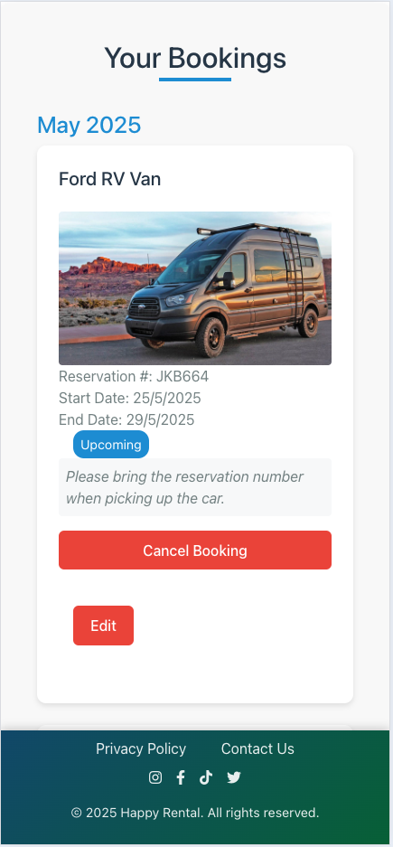

# Happy Rental Jönköping

## Introduction 

Welcome to Happy Rental Jönköping! This is a small, local company dedicated to providing car and RV van rentals in the beautiful city of Jönköping, located in the scenic region of Småland, Sweden. The goal of this app is to make it easy for visitors and residents alike to rent vehicles and discover all the wonderful sights that this area has to offer. With this platform, users can conveniently explore Jönköping and its surroundings, enjoying their days in this amazing part of Sweden. I’m excited to share the features and ideas behind this project with you!

### User Stories

#### Navigating the Site

* As a user I can view a navbar so that I can easily navigate the site

#### Authentication

* As a user, I want to register for an account so that I can unlock and use all features available to authenticated users.
* As a user, I want to log in to my account so that I can access personalized functionalities and content.
* As a user, I want to easily determine if I am currently logged in because the navbar updates to show different links, including a 'Log Out' option, so I can decide whether to log in or log out accordingly.
* As a user, I want to stay logged in until I actively choose to log out, ensuring a smooth and uninterrupted experience.

#### About Us Page

* As a user, I want to learn about the company's history and mission so that I can understand what drives their services.
* As a user, I want to see the company's achievements and future plans so that I can trust their growth and commitment.
* As a user, I want to get to know the team and their values so I feel confident about engaging with their services.

#### Rent Page

* As a user, I want to select my desired rental dates on the calendar so that I can specify the period I want to book a car.
* As a user, I want to see available cars based on my selected dates so I can choose the most suitable vehicle for my trip.
* As a user, I want to receive feedback after I book a car, such as a confirmation message, so I know my reservation was successful.
* As a user, I want to see clear information about the steps involved in booking a car so I understand the process and what to expect.

#### All Cars Page

* As a user, I want to see a list of all available cars with basic details so I can compare options and select a suitable vehicle.
* As a user, I want each car to display important information including description, price, model, and maximum passengers so I can make an informed decision.
* As a user, I want the car information to be clear and well-organized, so I can easily understand the features and specifications of each vehicle.

#### My Rentals Page

* As a user, I want to see a list of all my current and past bookings so I can keep track of my reservations.
* As a user, I want each booking to display key details such as car information, rental dates, and reservation number so I can easily identify each reservation.
* As a user, I want to be able to cancel or modify my upcoming bookings directly from the list so I can manage my reservations efficiently.

#### Reviews Page

* As a user, I want to see reviews and ratings from other customers so that I can get an idea of their experiences.
* As a user, I want to be able to write and submit my own review and rating, so I can share my feedback about the service.
* As a user, I want to edit or delete my own reviews so that I can update or remove my feedback if needed.
* As a user, I want to view reviews even when I am not logged in so that I can consider feedback before deciding to sign in or make a reservation.

#### Contact Page 

* As a user, I want to be able to contact the company so I can ask questions or get assistance when needed.
* As a user, whether registered or not, I want to send a message to the company through the contact form so I can inquire about services or issues even without logging in.

#### Social Media

* As a user, I would like to see the company's social media pages so that I can follow or engage with them on different platforms.

#### Admin Stories 

* As an admin, I want to be able to manage user interactions and content by deleting offensive or harmful comments, reviews, or user accounts. This allows me to maintain a safe and respectful environment within the platform.
* Additionally, I want to be able to view contact messages and reviews to monitor feedback and ensure user concerns are addressed promptly.
* Overall, I need control over user management and content moderation to uphold community standards and protect employees and users from disrespectful behavior.

#### User Stories Information

* Initially, I outlined high-level user stories to guide the overall structure and features of the project, focusing on the main functionalities users would need. As I progressed, I created more detailed, specific user stories in GitHub to break down those broader goals into actionable tasks and edge cases, helping to refine the development process and ensure a thorough understanding of each component.

### Agile Aproach

The project was organized with associated user stories and tasks using GitHub Projects. You can find the project at [Car Rental booking App](https://github.com/users/Yuss76A/projects/10/views/1).

* Here, you can see the user stories that I previously shared, but in a more detailed form, which were developed from those initial stories. Up to user story number 9, they mainly focused on the backend functionalities. Additionally, I created stories related to the frontend, which are explicitly labeled as "front end" in the titles. I included these front-end stories to ensure I didn’t forget any important aspects during the development process, even if some of them might overlap with the backend stories. This way, I aimed to cover all the key features and avoid missing anything crucial while building the project.

## Design Choices

### Fonts

Arial, sans-serif, and Georgia were chosen as the primary fonts for the project because they are classic, widely supported, and ensure good readability across different devices and browsers. These fonts provide a clean and professional look, making the content easy to read and visually accessible. Since they are system fonts, they also help improve page load times and maintain consistency without relying on external font libraries, which is beneficial for the overall performance and reliability of the website.

### Colours

Colours for the website where selected using [Coolors](http://coolors.co "Coolors").

* #333 (Dark Gray) - Used for main headings and titles (e.g., .about-us-title, .pageTitle) to provide a strong, neutral contrast for readability.
* #555 (Medium Gray) - Body text and content descriptions, offering a softer contrast for readability without being too harsh.
* #2c3e50 - Used for main titles and headings (e.g., .pageTitle) to give a dark, professional tone and for overall navigation header text.
* #d32f2f - Indicates errors, warning states, and alert messages (e.g., .errorMessage, .error, .cancelButton hover). Conveys urgency and failure status.
* #27ae60 - Success notifications and positive status indicators (e.g., .successAlert, .statusMessage.success).
* #3498db - Emphasizes interactive elements such as icons, links, buttons.
* #f0f8ff - Background colors for sections like "how-it-works" and rental process steps. Creates a calm, welcoming environment.
* #f9f9f9 - Background for form sections, containers, and buttons to provide a neutral, clean interface.
* #f8f9fa -  Light backgrounds and border colors for containers, input fields, and layout elements, maintaining a minimalistic and clean look.
* #c3cfd9 - Used mainly for background gradients in containers, adding subtle visual interest without distracting from content.
* #718096 (Grayish Blue) - Muted text or secondary information like reminder texts.
* #ffffff (White) - Backgrounds for text boxes, buttons, cards, and containers, ensuring high contrast for text readability.
* #000000 (Black) - Not explicitly used in the CSS provided, but typically used for textual emphasis when needed.

### Navbar and Footer Colours

Navbar:
* Background: A linear gradient with shades of blue: linear-gradient(135deg, #2874a6 0%, #239b56 100%)
* Text and icons (brand, links, toggler icon): White (#ffffff), with transition effects for hover interactions

Footer:
* Background: Same as the navbar gradient: linear-gradient(135deg, #2874a6 0%, #239b56 100%)
* Text: White (#ffffff) for links and copyright text
* Hover Effects: Links change to pure white for emphasis, with underline or color transition (color: white; text-decoration: underline;)
* Responsive footer: Slightly darker gradient for smaller screens: linear-gradient(135deg, #1a5276 0%, #186a3b 100%)

Summary:
* Navbar and footer share a consistent blue-green gradient color scheme with white text and icons.

.

Colours Information Text:

- I have made an effort to carefully note and keep track of all the colors used throughout the project. I aimed to clearly explain the purpose of each color and the reasons for their selection. However, given the size and complexity of the project, there is a possibility that I may have unintentionally overlooked mentioning some colors. I apologize if I missed any details, and I appreciate your understanding.

### Icons

The icons used for the site were sourced from [Font Awesome](https://fontawesome.com/ "Font Awesome").

## Structure

The website’s architecture is divided into frontend and backend components. The frontend will be developed using [React](https://react.dev/), complemented by custom [CSS](https://en.wikipedia.org/wiki/CSS) for styling, and [React Bootstrap](https://react-bootstrap.netlify.app/) to ensure a cohesive and modern design. The backend will be implemented with [Django Rest Framework](https://www.django-rest-framework.org/), responsible for managing all data and efficiently passing it to the frontend as required. This setup aims to provide a reliable, scalable, and user-friendly system.

### Database Models

#### Car Model

| Object             | Field                |
|--------------------|----------------------|
| name               | CharField            |
| type               | CharField (choices)  |
| price_per_day      | IntegerField         |
| currency           | CharField            |
| max_capacity       | IntegerField         |
| description        | TextField            |

#### CarImage Model

| Object     | Field             |
|------------|-------------------|
| image      | CloudinaryField   |
| caption    | CharField         |
| car        | ForeignKey        |

#### BookedDate Model

| Object            | Field                   |
|-------------------|-------------------------|
| car               | ForeignKey              |
| user              | ForeignKey              |
| start_date        | DateField               |
| end_date          | DateField               |
| reservation_number| CharField               |

#### User Model

| Object     | Field                  |
|------------|------------------------|
| email      | EmailField             |
| full_name  | CharField              |
| username   | CharField (optional)   |

#### Contact Model

| Object    | Field                      |
|-----------|----------------------------|
| name      | CharField                  |
| email     | EmailField                 |
| message   | TextField                  |
| created_at| DateTimeField              |

#### Review Model

| Object    | Field                      |
|-----------|----------------------------|
| user      | ForeignKey                 |
| rating    | IntegerField               |
| comment   | TextField                  |
| created_at| DateTimeField              |

### React Components Example

The front end of this project was built using React, specifically version 19.1.0. React enables the development of reusable components that manage their own states and can be combined to create complex user interfaces. These components facilitate dynamic and interactive features on the site, enhancing user experience. The main components developed for this project are listed below. These components will be discussed in more detail in the features section of this readme.

### Navbar

Implements a responsive navigation bar that displays links based on user authentication status, including logout functionality.

### Footer

Creates a footer with navigation links and social media icons, along with a copyright notice, providing site-wide footer content and links.

### About Us 

Combines company history, achievements, and rental process details with engaging visuals and icons, providing visitors with comprehensive information about the business and how to get started.

### Rent

Provides a dynamic calendar interface for users to select rental dates, filters available cars based on those dates, and facilitates the booking process with real-time feedback and car details display.

### All Cars

Displays detailed information about a specific car, including model name, price per day, maximum passengers, and description, with fallback values for missing data for better user experience.

### My Rentals

Manages and displays the user's booked dates, allowing them to view, edit, or cancel reservations, with real-time data fetching and state management for bookings and car details.

### Reviews 

Manages user reviews with functionalities to create, update, delete, and paginate reviews, including form validation, error handling, and integration with backend API, offering a complete review management system.

### Contact

Provides a user-friendly contact form with validation, submitting messages via API, and displaying success or error notifications to facilitate communication between users and the service.

### Private Policy

Presents a comprehensive overview of how user data is collected, used, shared, and protected, ensuring transparency and building trust with visitors about their privacy and data security.

### Wireframes

Wireframes have been created using [Balsamic](https://balsamiq.com "Balsamic"). Wireframes provide a foundational visual overview of the website’s intended layout and structure. Please note that the final implementation may include slight adjustments to optimize user experience and design aesthetics.

**About Us Page Wireframe**

**Rent Page Wireframe**

**All Cars Page Wireframe**

**Reviews Page Wireframe**

**My Rentals Page Wireframe**

**Private Policy Page Wireframe**

**Contact Us Page Wireframe**

**Sign In Page Wireframe**

**Sign Up Page Wireframe**

**Review Page Logout Mode Wireframe**

## Features

### About Us Page

This page thoughtfully combines essential information about the company's journey, milestones, and operational procedures. It features a detailed overview of the company's history, highlighting key achievements such as awards, expansion milestones, and sustainability initiatives, which build trust and credibility. The "How It Works" section guides users through the rental process step-by-step, making it easy for new customers to understand how to utilize the service. Together, these elements create an informative, engaging, and professional presentation of our brand's story and operational excellence.

**About Us Page**

**About Us Page**

**About Us Page**

### Rent Page

The Booking Component offers a user-friendly way to choose your rental dates. Once you select your desired dates and click the "Book Cars" button, the available cars will appear below the calendar. You also can toggle additional information about the rental process. If some cars are already booked for those dates, they won’t be available for selection. The seamless design provides a smooth experience from selecting dates to finalizing your reservation—making everything simple, clear, and enjoyable for you.

Additionally, when you successfully book a car, you will receive a unique reservation code. This code is randomly generated each time and serves as your personal confirmation. It helps you easily manage and reference your booking, ensuring a hassle-free experience from start to finish.

**Rent Page**

**Rent Page Mobile Mode**

### All Cars Page

The All Cars Page showcases the company's entire fleet of vehicles in a clean, organized grid layout, with three cars displayed per row. Visitors can view detailed information about each car, including pictures, prices, and other specs—all fetched dynamically from the backend Django server. This comprehensive listing makes it easy for users to explore the full selection of available vehicles, helping them find the perfect car for their needs. The page also features loading indicators during data retrieval and handles errors smoothly, providing a seamless browsing experience.

**All Cars Page**

**All Cars Page Mobile Mode**

### Reviews Page

The Reviews page displays feedback from all customers, allowing everyone—including visitors who are not signed in—to read honest reviews about our services. Reviews are submitted anonymously to protect user privacy. Registered users can leave their own reviews, as well as edit or delete their feedback at any time. If you're not logged in, you can still browse the reviews to get a sense of others' experiences, but sharing your own feedback requires signing in. This setup encourages transparency while maintaining user privacy and control over their submissions.

**Reviews Page**

**Reviews Page Mobile Mode**

**Reviews Page LoggedOut**

**Reviews Page Mobile Mode LoggedOut**

### My Rentals Page

This page provides a comprehensive view of all your active and upcoming bookings. You can see detailed information for each reservation, including the start and end dates, a picture of the car, and your unique reservation number. The reservations are organized by month and year, making it easy to navigate through your upcoming trips. The interface allows you to manage your bookings with options to edit or cancel, giving you full control and clear visibility over your rentals. When editing a booking, if the car you choose is already booked for the new dates, an error message will be displayed, and the change will not be processed. It’s all designed to be simple, transparent, and convenient for you.

**My Rentals Page**

**My Rentals Page Mobile Mode**

### Private Policy

This page outlines how Happy Rental collects, uses, shares, and protects your personal information. It details the types of data we gather when you rent a vehicle, including personal details, payment information, and technical data. It explains how your data helps us manage reservations, improve our services, and comply with legal requirements. The policy also emphasizes our commitment to data security and your rights to access, update, or delete your information. For any privacy-related questions, you can find contact details and learn more about how we safeguard your data. Overall, this page ensures transparency and builds trust by clearly communicating our privacy practices.

**Private Policy Page**

**Private Policy Page Mobile Mode**

### Conta Us Page

This contact form allows users, whether registered or not, to easily reach out with questions or comments about our car booking services. It includes fields for full name, email, and message, with validation to ensure the user provides all necessary information correctly. When a user submits the form, the data is sent to our backend, and the user receives feedback confirming whether their message was successfully sent or if there was an error. The design emphasizes simplicity and user-friendliness, enabling efficient communication and helping us improve customer engagement.

**Contact Us Page**

**Contact Us Page Mobile Mode**

### Sign Up Page

This component features a clean, modern design that invites new users to create an account by entering their name, email, and password. It includes validation to ensure passwords match and provides real-time feedback to guide users. A friendly prompt — "If you already have an account, sign in" — offers a quick way for returning users to navigate to the login page. The registration process is integrated with Django's built-in authentication system, which handles user creation and validation seamlessly in the background. The form’s simple and user-friendly layout encourages new registrations with an effortless onboarding experience.

**Sign Up Page**

**Sign Up Page Mobile**

### Login Page ( Sign In)

This component provides a sleek and straightforward interface that allows users to access their accounts by entering their email and password. It communicates with the backend, which is built on Django’s robust authentication system, to verify credentials securely. When login is successful, user information and authentication tokens are stored locally, and the user is redirected back to their previous activity or the homepage. The form is designed for simplicity and clarity, offering helpful feedback for invalid credentials and ensuring a smooth, efficient login experience for every user.

**Login Page**

**Login Page Mobile**

### Navbar

The navbar has a classic, clean design that blends well with the overall style of the site. Its background features a vibrant gradient from deep blue to lush green, which reflects the company's support for sustainable vehicles and eco-friendly initiatives. The color scheme—rich greens and blues—creates a fresh, natural, and trustworthy feel, emphasizing the company's commitment to environmental responsibility.

The layout is straightforward and easy to navigate, with links for key pages like "About Us," "Rent," "All Cars," and "Reviews." When users are logged in, a "Logout" button appears, providing a clear way to sign out. If not logged in, users see options to "Login" or "Sign Up." 

Importantly, while anyone can browse the "Rent" and "Reviews" pages, they need to be registered and logged in to make bookings or leave reviews, maintaining a secure and user-focused service.

The design ensures a seamless experience across devices, with responsive adjustments for smaller screens, including stylish burger menus that fit neatly into mobile views. Overall, the color palette and layout reinforce the brand’s focus on sustainability while offering a professional and inviting interface for all users.

**Navbar**

**Navbar Logged Out**

**Navbar Mobile**

**Navbar Mobile Logged Out**

### Footer

The footer is a fixed, full-width component positioned at the bottom of the page, providing easy access to important links and social media profiles. Its background features a gradient from deep blue to lush green, reflecting the company's focus on sustainability and eco-friendly initiatives. The footer includes links to the Privacy Policy and Contact page, helping users find essential information quickly. Social media icons for Instagram, Facebook, TikTok, and Twitter are prominently displayed, encouraging visitors to connect with us on various platforms. The overall design ensures clarity and accessibility across all devices, with responsiveness tailored for smaller screens. It’s styled with smooth hover effects and a subtle shadow to distinguish it from the main content, maintaining a professional and trustworthy appearance.

**Footer**

**Footer Mobile**

### Rating

Logged-in users can rate the company on a scale from 0 to 5 stars. The rating is visually displayed with stars filled in gold or yellow, providing a clear and attractive overview. For example, if a user gives a rating of 2 out of 5, two stars will be filled, and the remaining three stars will be empty, making the feedback easy to understand at a glance.

**Rating**

### Review Link Navbar

The navigation bar includes a direct link to the Reviews page, marked with a star icon. This makes it easy for users to quickly access customer feedback and see honest reviews from others. The star icon helps draw attention to this section, encouraging visitors to explore what others think about our service. Whether you're looking for insights or want to share your own experience, this link provides a convenient shortcut at the top of the site.

**Review Link**

### Social Media Links

The footer includes icons linking to the company's official social media profiles—Instagram, Facebook, TikTok, and Twitter. These icons provide visitors with quick access to follow or engage with the company on various platforms. Each link opens in a new tab to ensure users remain on the website while exploring the social content. Incorporating these links helps increase online visibility and encourages community interaction, aligning with the brand’s modern and professional look.

**Social Media**
